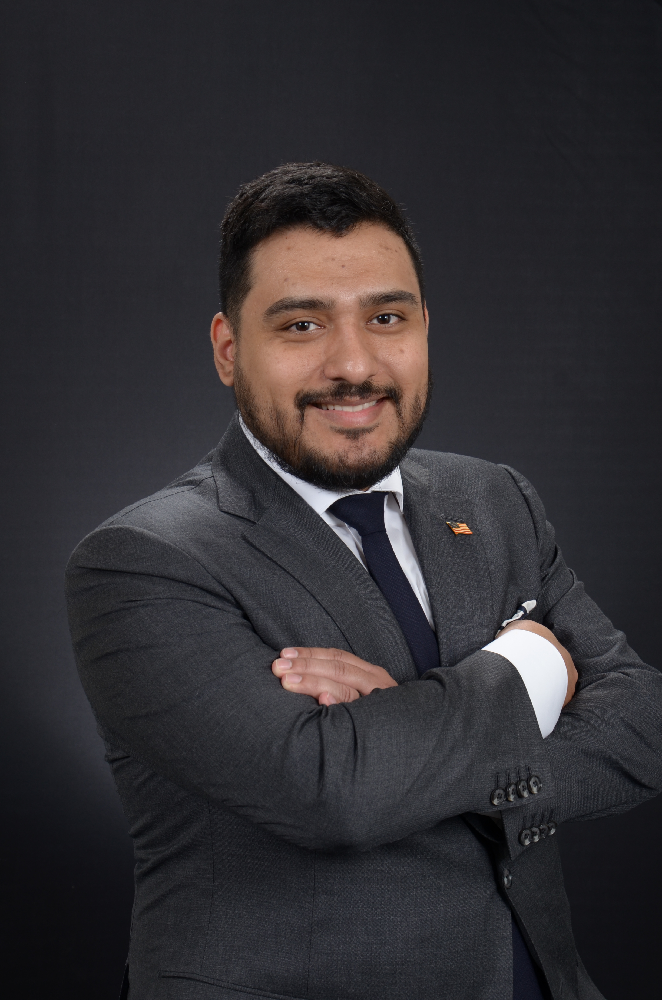

# Alexander G. Arias' Developer Page

## My Ethos:

> _Regardless of the titles we inherit or earn, it is our enduring resilience and capacity to navigate the unresolved complexities of life that truly defines us. Amidst adversity and achievement, it is our ability to rise, persevere, and find our inner strength that remains the most significant testament to our character._

## About Me:

Former Mortar Man Infantryman with the US Army, I leveraged my disciplined approach and resilience when I embarked on a new mission in academia. Beginning at community college in 2017, I challenged myself by quadruple majoring in physics, mathematics, computer science, and university studies in math and science, resulting in four associate degrees by spring 2020.

Having been accepted into multiple prestigious institutions, I chose to specialize in Computer Science at UCSD. Currently, in my 4th year, I have honed my skills in everything from basic to advanced programming concepts, including data structures, algorithms, and machines. I am a proud two-time member of the Muir Caledonian Honor Society and have maintained a 3.8 overall GPA - a testament to my commitment and tenacity.

Recently, I had the honor of being invited to participate in the National Name Exchange, indicating my potential for graduate studies. As I look forward to graduating in Fall 2023, I am excited about leveraging my academic and military experiences to contribute to the field of computer science. I am actively seeking opportunities to apply my unique skill set and grow as a professional in the tech industry

You can check out my [LinkedIn](www.linkedin.com/in/alexander-arias-1bb58a111) if you're interested.

### My Hobbies:

- **Video Games:** I have a few favorite titles like ***Metal Gear Solid***, ***Monster Hunter***. and ***Elder Scrolls***.
- **Programming:** I have been programming for the past 6 years through the means of school.
- **Active Learning:** I like watching podcasts, reading books, and searching up tutorials on the web. 
- **Electron Repairs:**  I like to open up broken electronics to try and fix them. 
  -  I fixed my $1000+ TV by doing this, and a few game controllers in the past, which was cool!

### Quiz Time!

**How many degrees did I graduate with?**
- [] It is definetly 0
- [] I want to say 2?
- [] I honestly can't remember
- [] It was 4!

**What branch of the military did I serve in?**
- [] Army
- [] Marines
- [] Navy
- [] Airforce
- [] Spaceforce
- [] Coat gaurd (Is this even a military branch?)

**Did you like my Quiz?**
- [] Yes!
- [] No!
- [] Sorta?

